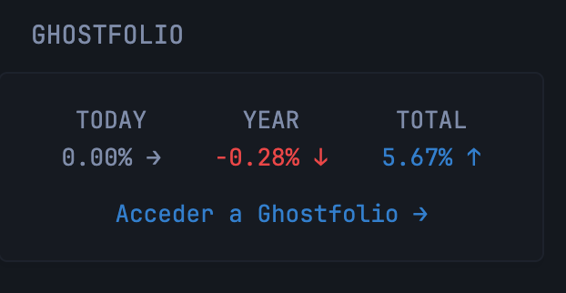

```yaml
- type: custom-api
  title: Ghostfolio
  cache: 5m
  # Replace with the URL of your Ghostfolio instance and your public access ID (My Ghostfolio/Access/Add new)
  # Example: https://your-ghostfolio-instance.com/api/v1/public/YOUR-PUBLIC-ID/portfolio
  url: ${GHOSTFOLIO_PUBLIC_URL}
  template: |
    {{ if eq .Response.StatusCode 200 }}
      <div style="display: flex; justify-content: space-between;">
        <div style="flex: 1; text-align: center;">
          <p>TODAY</p>
          <div style="display: flex; justify-content: center; align-items: center;">
            <p class="{{ if gt (.JSON.Float "performance.1d.relativeChange") (toFloat 0) }}color-positive{{ else if lt (.JSON.Float "performance.1d.relativeChange") (toFloat 0) }}color-negative{{ end }}">
              {{ .JSON.Float "performance.1d.relativeChange" | mul 100 | printf "%.2f" }}%
              {{ if gt (.JSON.Float "performance.1d.relativeChange") (toFloat 0) }}
                ↑
              {{ else if lt (.JSON.Float "performance.1d.relativeChange") (toFloat 0) }}
                ↓
              {{ else }}
                →
              {{ end }}
            </p>
          </div>
        </div>
        <div style="flex: 1; text-align: center;">
          <p>YEAR</p>
          <div style="display: flex; justify-content: center; align-items: center;">
            <p class="{{ if gt (.JSON.Float "performance.ytd.relativeChange") (toFloat 0) }}color-positive{{ else if lt (.JSON.Float "performance.ytd.relativeChange") (toFloat 0) }}color-negative{{ end }}">
              {{ .JSON.Float "performance.ytd.relativeChange" | mul 100 | printf "%.2f" }}%
              {{ if gt (.JSON.Float "performance.ytd.relativeChange") (toFloat 0) }}
                ↑
              {{ else if lt (.JSON.Float "performance.ytd.relativeChange") (toFloat 0) }}
                ↓
              {{ else }}
                →
              {{ end }}
            </p>
          </div>
        </div>
        <div style="flex: 1; text-align: center;">
          <p>TOTAL</p>
          <div style="display: flex; justify-content: center; align-items: center;">
            <p class="{{ if gt (.JSON.Float "performance.max.relativeChange") (toFloat 0) }}color-positive{{ else if lt (.JSON.Float "performance.max.relativeChange") (toFloat 0) }}color-negative{{ end }}">
              {{ .JSON.Float "performance.max.relativeChange" | mul 100 | printf "%.2f" }}%
              {{ if gt (.JSON.Float "performance.max.relativeChange") (toFloat 0) }}
                ↑
              {{ else if lt (.JSON.Float "performance.max.relativeChange") (toFloat 0) }}
                ↓
              {{ else }}
                →
              {{ end }}
            </p>
          </div>
        </div>
      </div>
      <div style="text-align: center; margin-top: 10px;">
        <a href="${GHOSTFOLIO_URL}" style="text-decoration: none; color: var(--color-primary);">Access Ghostfolio →</a>
      </div>
    {{ else }}
      <div style="text-align: center; color: red;">
        Error connecting to Ghostfolio: {{ .Response.StatusCode }}
      </div>
    {{ end }}
```

## Environment variables

- `GHOSTFOLIO_URL` - the URL of the Ghostfolio instance
- `GHOSTFOLIO_PUBLIC_URL` - You need to create a public acces url under menu My Ghostfolio -> Acces - Add
