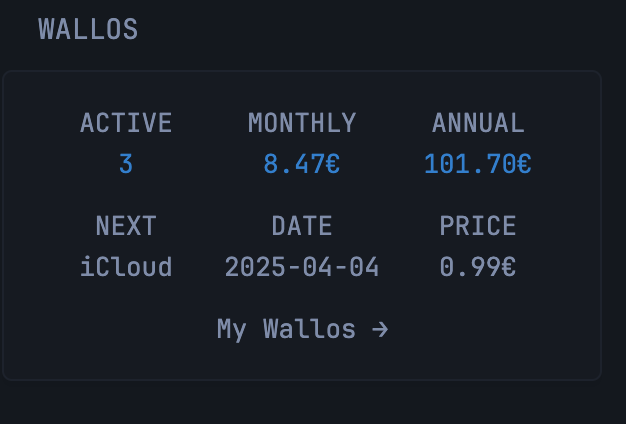

```yaml
# Wallos Integration for Glance
# This widget displays information from your Wallos subscription manager
# 
# Configuration Instructions:
# 1. Replace {$your-wallos-api-endpoint} with your Wallos server IP or hostname
# 2. Replace {$your-api-key} with your Wallos API key
# 3. Optionally adjust the cache time (default: 5m)
# 4. You can change the currency symbol from € to your preferred currency

- type: custom-api
  title: Wallos
  cache: 5m
  # Replace with your Wallos API endpoint
  url: http://{$your-wallos-api-endpoint}/api/subscriptions/get_subscriptions.php?state=0&api_key={$your-api-key}
  template: |
    {{ if eq .Response.StatusCode 200 }}
      <div style="display: flex; justify-content: space-between;">
        <div style="flex: 1; text-align: center;">
          <p>ACTIVE</p>
          <p class="color-positive">
            {{ len (.JSON.Array "subscriptions") }}
          </p>
        </div>
        <div style="flex: 1; text-align: center;">
          <p>MONTHLY</p>
          <p class="color-positive">
            {{ $total := 0.0 }}
            {{ range .JSON.Array "subscriptions" }}
              {{ $price := .Float "price" }}
              {{ $cycle := .Int "cycle" }}
              {{ $frequency := .Float "frequency" }}
              {{ $monthlyCost := $price }}
              {{ if eq $cycle 1 }}  <!-- Daily cycle -->
                {{ $monthlyCost = mul (div $price $frequency) 30.4375 }}
              {{ else if eq $cycle 2 }}  <!-- Weekly cycle -->
                {{ $monthlyCost = mul (div $price (mul $frequency 7.0)) 30.4375 }}
              {{ else if eq $cycle 3 }}  <!-- Monthly cycle -->
                {{ $monthlyCost = div $price $frequency }} 
              {{ else if eq $cycle 4 }}  <!-- Yearly cycle -->
                {{ $monthlyCost = div $price (mul $frequency 12.0) }}
              {{ end }}
              {{ $total = add $total $monthlyCost }}
            {{ end }}
            {{ printf "%.2f" $total }}€  <!-- Format total to 2 decimal places -->
          </p>
        </div>
        <div style="flex: 1; text-align: center;">
          <p>ANNUAL</p>
          <p class="color-positive">
            {{ $annualTotal := mul $total 12 }}
            {{ printf "%.2f" $annualTotal }}€
          </p>
        </div>
      </div>
      <!-- Next renewal -->
      <div style="display: flex; justify-content: space-between; margin-top: 10px;">
        <div style="flex: 1; text-align: center;">
          <p>NEXT</p>
          {{ $nextDate := "" }}
          {{ $nextName := "" }}
          {{ $nextPrice := 0.0 }}
          {{ range .JSON.Array "subscriptions" }}
            {{ if eq $nextDate "" }}
              {{ $nextDate = .String "next_payment" }}
              {{ $nextName = .String "name" }}
              {{ $nextPrice = .Float "price" }}
            {{ else if lt (.String "next_payment") $nextDate }}
              {{ $nextDate = .String "next_payment" }}
              {{ $nextName = .String "name" }}
              {{ $nextPrice = .Float "price" }}
            {{ end }}
          {{ end }}
          <p>{{ $nextName }}</p>
        </div>
        <div style="flex: 1; text-align: center;">
          <p>DATE</p>
          <p>{{ $nextDate }}</p>
        </div>
        <div style="flex: 1; text-align: center;">
          <p>PRICE</p>
          <p>{{ printf "%.2f" $nextPrice }}€</p>
        </div>
      </div>
      <!-- Link to Wallos instance -->
      <div style="text-align: right; margin-top: 10px;">
        <!-- Replace with your Wallos instance URL -->
        <a href="{$your-wallos-api-endpoint}" style="text-decoration: none; color: inherit;">My Wallos →</a>
      </div>
    {{ else }}
      <div style="text-align: center;" class="color-negative">
        Error connecting to Wallos: {{ .Response.StatusCode }}
      </div>
    {{ end }}
```

## Environment variables

- `your-wallos-api-endpoint` - CHANGE
- `your-api-key` - Configure and unique api key in your user profile
