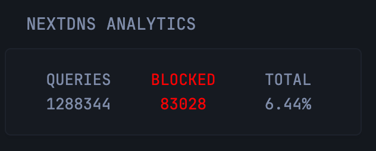

```yaml
- type: custom-api
  cache: 1h
  title: NextDNS Analytics
  url: https://api.nextdns.io/profiles/{$PROFILE_ID}/analytics/status
  headers:
    X-Api-Key: {$API_KEY}
  template: |
    {{ if eq .Response.StatusCode 200 }}
      <div style="display: flex; justify-content: space-between;">
        {{ $total := 0.0 }}
        {{ $blocked := 0.0 }}
        
        {{ range .JSON.Array "data" }}
          {{ $total = add $total (.Int "queries" | toFloat) }}
          {{ if eq (.String "status") "blocked" }}
            {{ $blocked = .Int "queries" | toFloat }}
          {{ end }}
        {{ end }}
        
        <div style="flex: 1; text-align: center;">
          <p>Queries</p>
          <p>{{ printf "%.0f" $total }}</p>
        </div>
        <div style="flex: 1; text-align: center; color: red;">
          <p>Blocked</p>
          <p>{{ printf "%.0f" $blocked }}</p>
        </div>
        <div style="flex: 1; text-align: center;">
          <p>Total</p>
          <p>{{ div (mul $blocked 100) $total | printf "%.2f" }}%</p>
        </div>
      </div>
    {{ else }}
      <div style="text-align: center; color: red;">
        Failed to fetch NextDNS data: {{ .Response.StatusCode }}
      </div>
    {{ end }}
```

## Environment variables

- `PROFILE_ID` - Your unique profile ID found in NextDNS control panel
- `API_KEY` - Configure and unique api key in your user profile
