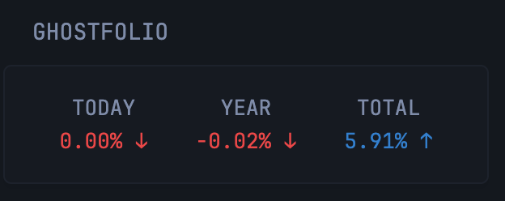

```yaml
- type: custom-api
  title: Ghostfolio
  title-url: ${GHOSTFOLIO_URL}
  cache: 5m
  url: ${GHOSTFOLIO_PUBLIC_URL}
  # Replace with the URL of your Ghostfolio instance and your public access ID (My Ghostfolio/Access/Add new)
  # Example: https://your-ghostfolio-instance.com/api/v1/public/YOUR-PUBLIC-ID/portfolio
  template: |
    {{ if eq .Response.StatusCode 200 }}
      <div style="display: flex; justify-content: space-between;">
        <!-- Sección TODAY -->
        <div style="flex: 1; text-align: center;">
          <p>TODAY</p>
          <div style="display: flex; justify-content: center; align-items: center;">
            <p class="{{ if gt (.JSON.Float "performance.1d.relativeChange") 0.0 }}color-positive{{ else }}color-negative{{ end }}">
              {{ mul (.JSON.Float "performance.1d.relativeChange") 100 | printf "%.2f" }}%
              {{ if gt (.JSON.Float "performance.1d.relativeChange") 0.0 }}↑{{ else }}↓{{ end }}
            </p>
          </div>
        </div>
        <!-- Sección YEAR -->
        <div style="flex: 1; text-align: center;">
          <p>YEAR</p>
          <div style="display: flex; justify-content: center; align-items: center;">
            <p class="{{ if gt (.JSON.Float "performance.ytd.relativeChange") 0.0 }}color-positive{{ else }}color-negative{{ end }}">
              {{ mul (.JSON.Float "performance.ytd.relativeChange") 100 | printf "%.2f" }}%
              {{ if gt (.JSON.Float "performance.ytd.relativeChange") 0.0 }}↑{{ else }}↓{{ end }}
            </p>
          </div>
        </div>
        <!-- Sección TOTAL -->
        <div style="flex: 1; text-align: center;">
          <p>TOTAL</p>
          <div style="display: flex; justify-content: center; align-items: center;">
            <p class="{{ if gt (.JSON.Float "performance.max.relativeChange") 0.0 }}color-positive{{ else }}color-negative{{ end }}">
              {{ mul (.JSON.Float "performance.max.relativeChange") 100 | printf "%.2f" }}%
              {{ if gt (.JSON.Float "performance.max.relativeChange") 0.0 }}↑{{ else }}↓{{ end }}
            </p>
          </div>
        </div>
      </div>
    {{ else }}
      <div style="text-align: center; color: red;">
        Error connecting to Ghostfolio: {{ .Response.StatusCode }}
      </div>
    {{ end }}
   ```

## Environment variables

- `GHOSTFOLIO_URL` - the URL of the Ghostfolio instance
- `GHOSTFOLIO_PUBLIC_URL` - You need to create a public acces url under menu My Ghostfolio -> Acces - Add
